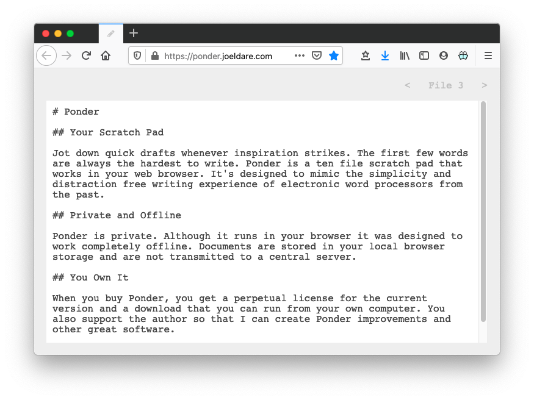

# Ponder

A simple text scratchpad that saves your thoughts.

## Getting Started

- Clone the repo
- Open `app/index.html` in your favorite browser

Ponder is a static web app. It stores it's data in local storage in the web browser. It can be hosted anywhere static sites can be hosted or it can be opened directly from your disk.

## Use Cases

I use Ponder as a quick scratch pad in my browser. As a web developer, I spend most of my day in the browser and Ponder is a quick and easy note tool for me.

I use it to jot down quick notes while I'm in meetings. If parts of those notes turn out to be important, I can copy/paste the notes to a more permanent document, into emails or messages, etc.

I use it to write longer comments that I'm going to send in chat apps like Slack. This prevents me from showing up as "Joel is typing" as I compose a longer message or response and it prevents me from accidentally sending something that I was finished writing.

I use it to write letters that I don't intend to keep electronic copies of. When you print ponder it hides the navigation, resulting in an old-school typewriter looking printed document.

## Open Source

Ponder is free and distributed as open source under the MIT license.
